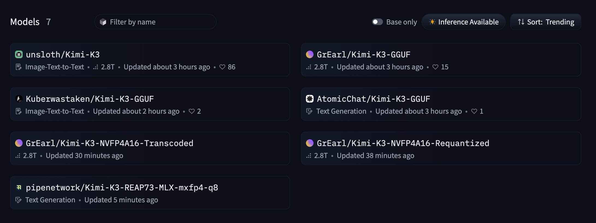
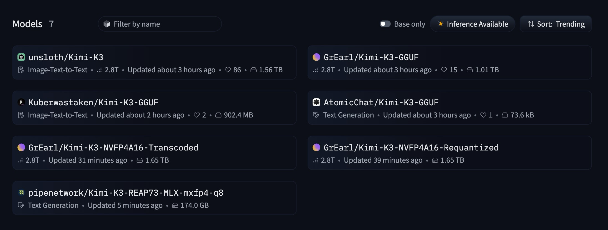

# HF Model Size

Chrome extension (Manifest V3) that shows total repo file sizes on Hugging Face.

| Before | After |
| --- | --- |
|  |  |

- **`/models` listing pages** — every model card gets a size badge at the end of its meta row (e.g. quantization searches like `?other=base_model:quantized:moonshotai/Kimi-K3`)
- **Model pages** (`/{author}/{name}`) — a size pill is added to the tag row under the model name, linking to the Files tab

The size is the same number shown on the repo's `/tree/main` page (sum of all files in the current revision, e.g. `1.56 TB`).

## Install

1. Open `chrome://extensions`
2. Enable **Developer mode** (top right)
3. Click **Load unpacked** and select this folder

## How it works

- Sizes are computed from the public Hub API: `GET /api/models/{id}/tree/main?recursive=true` (sum of every file's `size`, following `Link: rel="next"` pagination) — one request per unique repo
- No permissions required; requests are same-origin and use your existing HF session cookies
- Results are cached in `localStorage` for 12 hours and deduped in memory, so repeat views make zero requests
- Works with HF's client-side filtering/pagination via a `MutationObserver`
- Gated/private repos work if your account has access; repos with no files show no badge

## Rate limits

HF enforces rate limits per 5-minute fixed window on Hub API calls ([docs](https://huggingface.co/docs/hub/rate-limits)):

| Plan | API calls / 5 min |
| --- | --- |
| Anonymous (per IP) | 500 |
| Free account | 1,000 |
| PRO | 2,500 |
| Team org | 3,000 |
| Enterprise org | 6,000+ |

**Will this extension hit them?** Unlikely:

- Since requests carry your session cookies, logged-in users get the 1,000 tier — not the 500 anonymous IP tier
- A `/models` page has ~30 cards → ~30 API calls on first visit, then **zero for 12h** (cache)
- You would need ~17 fresh listing pages in 5 minutes (anonymous) or ~33 (logged in) to hit the cap
- If a 429 does happen, that badge simply doesn't render and fills in on the next page view — nothing breaks
